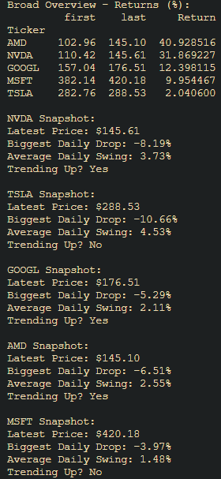
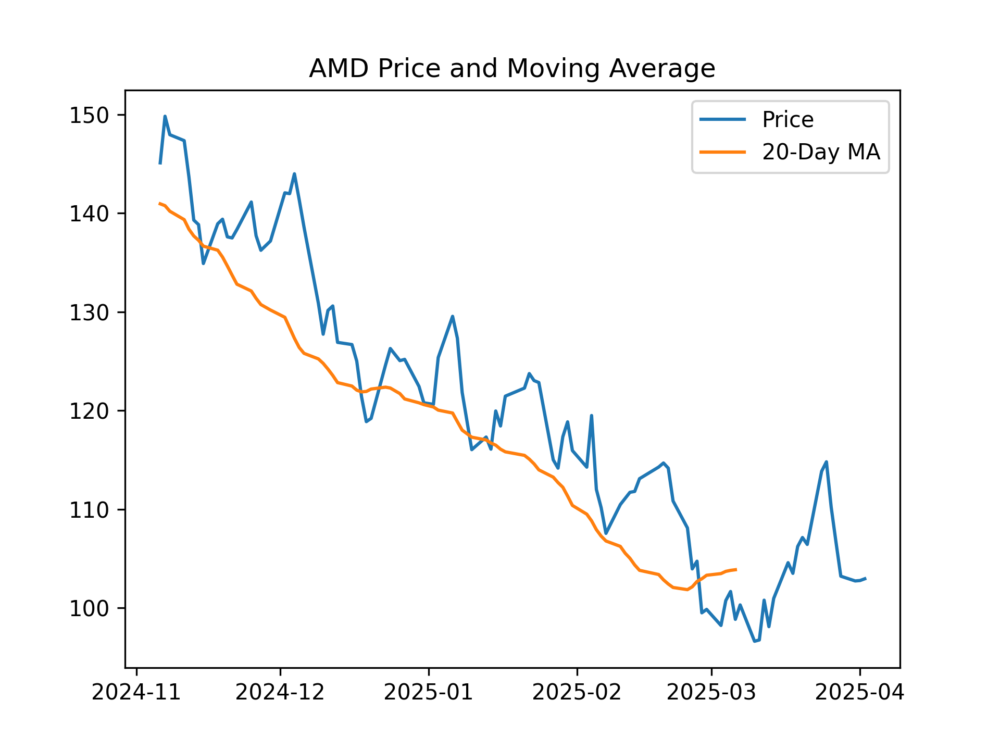
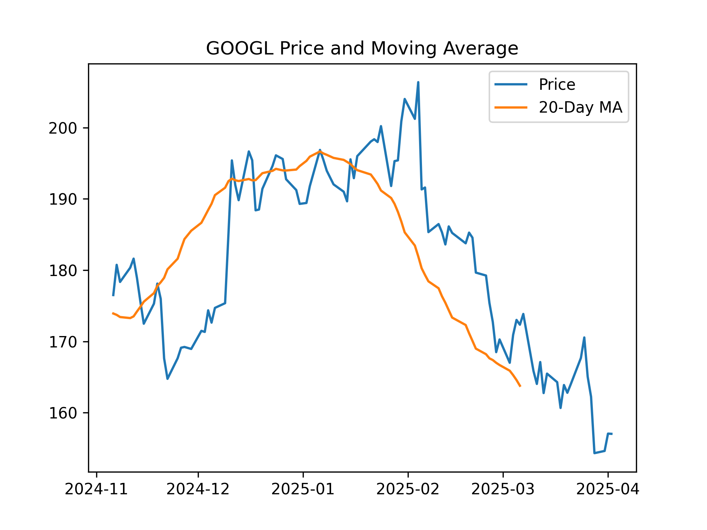
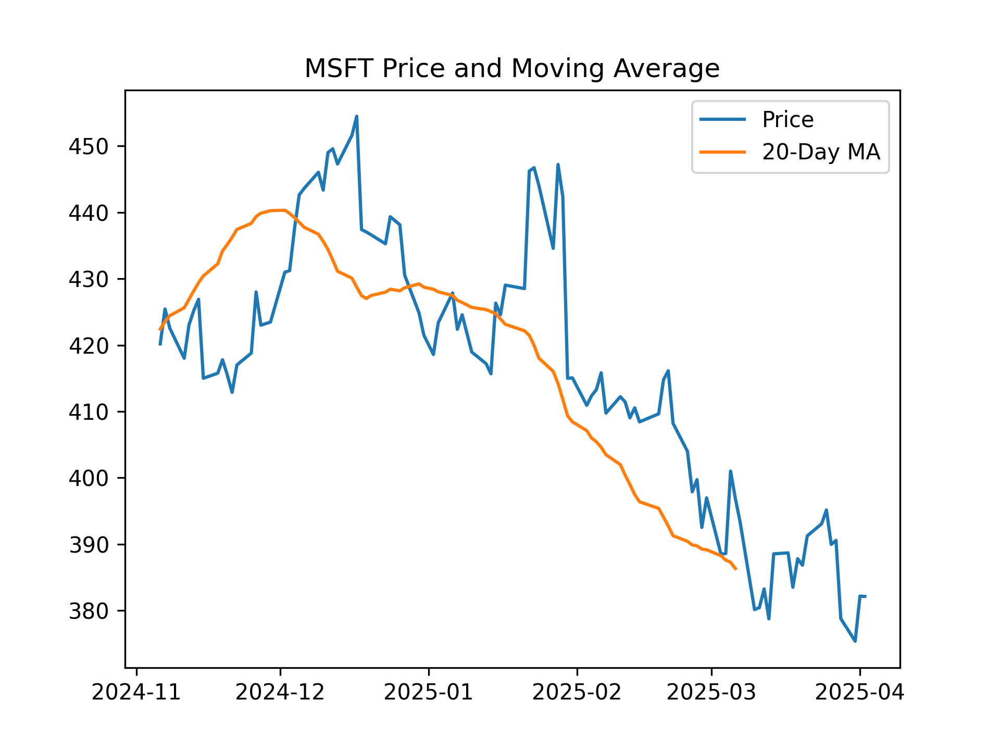
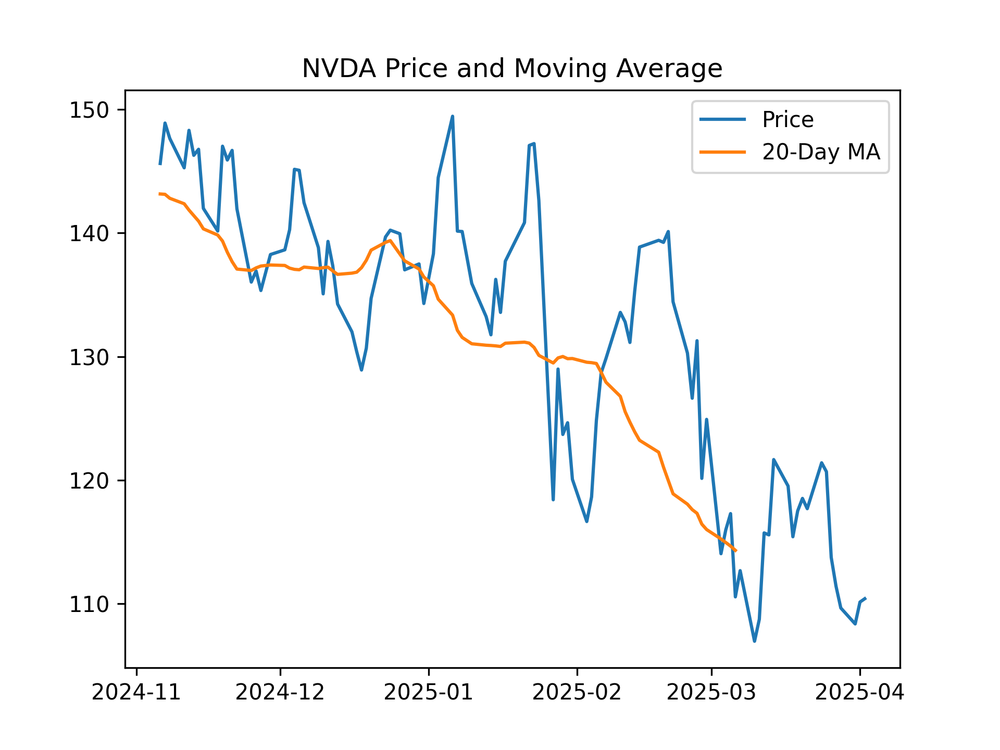
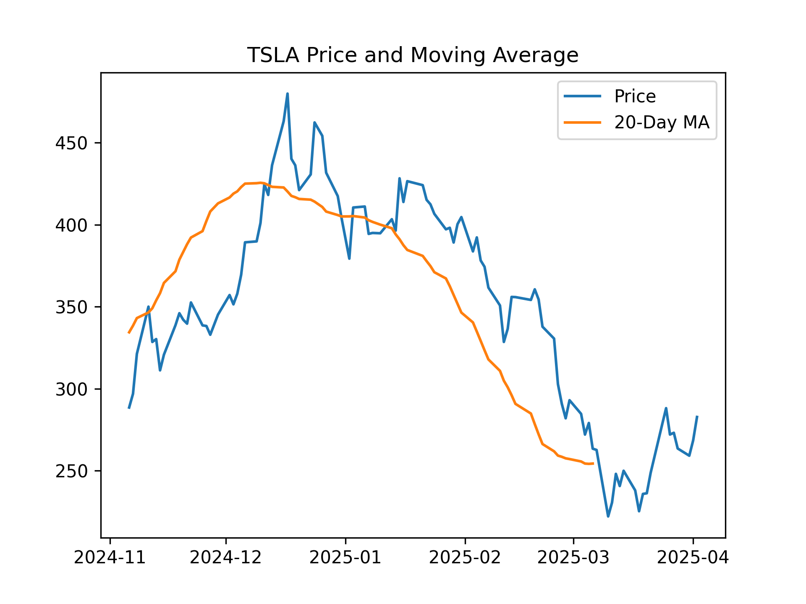

# Stock Market Analyzer

---

A minimalist yet powerful project that fetches, processes, and visualizes stock data for 5 major tickers using Alpha Vantage API. This tool provides a broad overview of returns and drill-down analytics for individual stocks.

## Features

- Pulls daily stock data for:
  - AMD
  - Google (GOOGL)
  - Microsoft (MSFT)
  - NVIDIA (NVDA)
  - Tesla (TSLA)
- Handles API rate limits gracefully (free tier ^\_^)
- Calculates return performance across tickers
- Generates moving averages and daily volatility stats
- Saves stock trend visualizations and individual drill-downs as PNGs

---

## Example Output

### Broad Trends



### AMD Drill Down



### GOOGL Drill Down



### MSFT Drill Down



### NVDA Drill Down



### TSLA Drill Down



---

## What Are We Looking At?

Each drill-down chart shows:

- The daily closing price for the stock
- A rolling 20-day moving average
- Used to assess short-term momentum and volatility
- Bonus stats printed in terminal: daily change %, volatility, trend signal

---

## To run on your own

1. Clone the repo
2. install dependencies

```bash
pip install -r requirements.txt
```

3. Set your .env file with your own API key

```bash
ALPHA_VANTAGE_API_KEY=your_api_key
```

4. Run the script

```bash
python data.py
```

5. Optional: Edit the tickers list in data.py to analyze different stocks.

## What's next?

- adding correlation matrix between stocks
- support for techincal indicators
- dashboard
